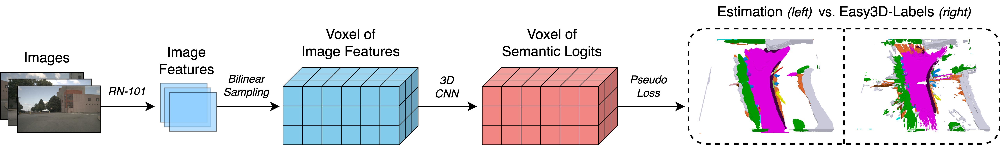
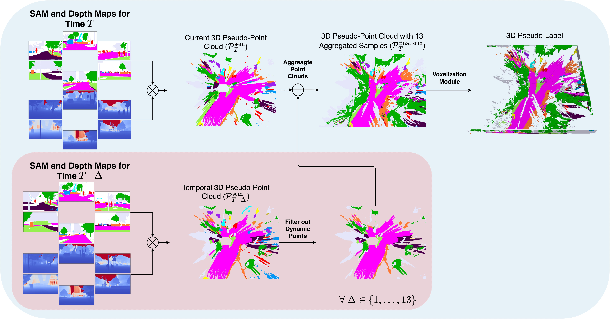

<div align="center">
  
# EasyOcc: 3D Pseudo-Label Supervision for Fully Self-Supervised Semantic Occupancy Prediction Models

<a href="https://scholar.google.com/citations?user=3fffnjYAAAAJ&hl=en&authuser=1" target="_blank"><strong>Seamie Hayes</strong></a><sup>1,2</sup>,
<a href="https://scholar.google.com/citations?user=356ahmwAAAAJ&hl=en&authuser=1" target="_blank"><strong>Ganesh Sistu</strong></a><sup>1</sup>,
<a href="https://scholar.google.com/citations?user=aH6w8VcAAAAJ&hl=en&authuser=1" target="_blank"><strong>Ciaran Eising</strong></a><sup>1,2</sup>

<sup>1</sup> D²iCE Research Centre, University of Limerick &nbsp;&nbsp; <sup>2</sup>Taighde Éireann – Research Ireland &nbsp;&nbsp;

[](https://arxiv.org/abs/2509.26087)
[](https://data.mendeley.com/datasets/XXXXXX)
</div>


## EasyOcc Model


## Easy3D-Labels: 3D Pseudo-Label Construction


## Abstract
_Self-supervised models have recently achieved notable advancements, particularly in the domain of semantic occupancy prediction. These models utilize sophisticated loss computation strategies to compensate for the absence of ground-truth labels. For instance, techniques such as novel view synthesis, cross-view rendering, and depth estimation have been explored to address the issue of semantic and depth ambiguity. However, such techniques typically incur high computational costs and memory usage during the training stage, especially in the case of novel view synthesis. To mitigate these issues, we propose 3D pseudo-ground-truth labels generated by the foundation models Grounded-SAM and Metric3Dv2, and harness temporal information for label densification. Our 3D pseudo-labels can be easily integrated into existing models, which yields substantial performance improvements, with mIoU increasing by 45\%, from 9.73 to 14.09, when implemented into the OccNeRF model.  This stands in contrast to earlier advancements in the field, which are often not readily transferable to other architectures. Additionally, we propose a streamlined model, EasyOcc, achieving 13.86 mIoU. This model conducts learning solely from our labels, avoiding complex rendering strategies mentioned previously. Furthermore, our method enables models to attain state-of-the-art performance when evaluated on the full scene without applying the camera mask, with EasyOcc achieving 7.71 mIoU, outperforming the previous best model by 31\%. These findings highlight the critical importance of foundation models, temporal context, and the choice of loss computation space in self-supervised learning for comprehensive scene understanding._

## Dataset
The dataset is publicly available on [Mendeley](https://data.mendeley.com/datasets/9scymfs7xv/1)

## Acknowledgement
This publication has emanated from research conducted with the financial support of Taighde Éireann – Research Ireland under Grant number 18/CRT/6049. For the purpose of Open Access, the author has applied a CC BY public copyright licence to any Author Accepted Manuscript version arising from this submission.

I would like to thank the authors of the following open-source projects:<br>
[GaussianOcc](https://github.com/GANWANSHUI/GaussianOcc)<br>
[OccNeRF](https://github.com/LinShan-Bin/OccNeRF)<br>

## Citation
```
@misc{hayes2025easyocc3dpseudolabelsupervision,
      title={EasyOcc: 3D Pseudo-Label Supervision for Fully Self-Supervised Semantic Occupancy Prediction Models}, 
      author={Seamie Hayes and Ganesh Sistu and Ciarán Eising},
      year={2025},
      eprint={2509.26087},
      archivePrefix={arXiv},
      primaryClass={cs.CV},
      url={https://arxiv.org/abs/2509.26087}, 
}
```
